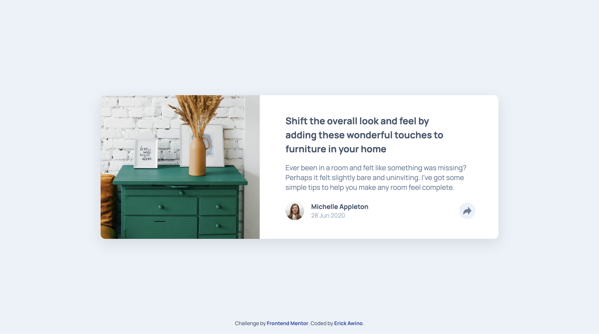

# Frontend Mentor - Article preview component solution

This is a solution to the [Article preview component challenge on Frontend Mentor](https://www.frontendmentor.io/challenges/article-preview-component-dYBN_pYFT). Frontend Mentor challenges help you improve your coding skills by building realistic projects.

## Table of contents

- [Overview](#overview)
  - [The challenge](#the-challenge)
  - [Screenshot](#screenshot)
  - [Links](#links)
- [My process](#my-process)
  - [Built with](#built-with)
  - [What I learned](#what-i-learned)
  - [Continued development](#continued-development)
  - [Useful resources](#useful-resources)
- [Author](#author)

## Overview

### The challenge

Users should be able to:

- View the optimal layout for the component depending on their device's screen size
- See the social media share links when they click the share icon

### Screenshot

I have attached the two screenshots of the solutions for mobile and desktop respectively.

### Links

- Solution URL: [Link to my github code](https://your-solution-url.com)
- Live Site URL: [Link to the live website component](https://your-live-site-url.com)

## My process

### Built with

- Semantic HTML5 markup
- CSS custom properties
- Flexbox

### What I learned

This excercise exposed me to new concepts in so far as CSS is concerned. I was also able to remind myself quite a bit about JS.

### Continued development

I want to start learning CSS grid because I entirely focused on using CSS flexbox for this solution. I also want to develop and ground mysekf more into JS.

### Useful resources

- [Example resource 1](https://developer.mozilla.org/en-US/docs/Web/CSS/word-break) - This helped me handle wordbreak instead of using the ` `.
- [Example resource 2](https://css-tricks.com/snippets/css/a-guide-to-flexbox/) - This is an amazing article which helped me find my way through flexbox. I'd recommend it to anyone still learning this concept.

## Author

- Frontend Mentor - [@yourusername](https://www.frontendmentor.io/profile/awinooliyo)
- Twitter - [@awwyoly](https://x.com/awwyoly)
